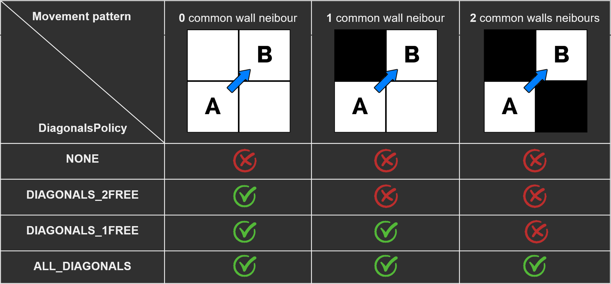

# Grid Toolkit

Utilitary API to proceed operations on abstract grids such as tile [extraction](#extraction), [raycasting](#raycasting), and [pathfinding](#pathfinding).

[Documentation](https://kevincastejon.github.io/com.caskev.grid-toolkit/)  

[Online Demo](https://kevincastejon.github.io/com.caskev.grid-toolkit/samples)

---
## Usage

All you need to use this API is a bi-dimensional array of tiles ordered in row major order (see below).

What is a *tile* ? Any object (custom class, struct, component, ...) that implements the very light **ITile** (**IWeightedTile** for *DijkstraGrid*) interface of this library. This interface requires three properties getters:
- *bool* **IsWalkable** . Must return if the tile can be walk/see throught (for pathfinding/raycasting)
- *int* **X** . Must return the horizontal position of the tile into the grid
- *int* **Y** . Must return the vertical position of the tile into the grid
- *float* **Weight** . Only for *IWeightedTile* Must return the cost movement to enter this tile (minimum 1f).

This API is using a namespace so you have to add a using instruction to the scripts that will use this library:
```cs
using Caskev.GridToolkit;
```

---
#### MajorOrder

When working with two-dimensional arrays there is two ways of storing tiles, first rows then lines or the opposite.  
This is called the **Major Order**. The most common major order used in C languages (and the one used in this library) is the row major order, meaning that the first index of the array represents the row index and the second index represents the column index.

Be aware that the row index actually indicates the vertical position of the tile in the grid, and the column index indicates the horizontal position of the tile in the grid, as it can be counter intuitive.
For more information you can refer to this [Wikipedia article](https://en.wikipedia.org/wiki/Row-_and_column-major_order).

---

## API

---

### Extraction

---
Allows you to extract tiles on a grid.  
Provides shape extraction (rectangles, circles, cones and lines) and neighbors extraction with a lot of parameters.

---
You can extract tiles from shapes.

- **GetTilesInARectangle**
```cs
YourCustomTileType[] tiles = Extraction.GetTilesInARectangle(grid, centerTile, rectangleSize);
```
- **GetTilesInACircle**
```cs
YourCustomTileType[] tiles = Extraction.GetTilesInACircle(grid, centerTile, radius);
```
- **GetTilesInACone**
```cs
YourCustomTileType[] tiles = Extraction.GetTilesInACone(grid, startTile, length, openingAngle, direction);
```
- **GetTilesOnALine**
```cs
YourCustomTileType[] tiles = Extraction.GetTilesOnALine(grid, startTile, length, direction);
```

---
You can extract neighbors of a tile (if existing).

- **GetTileNeighbour**
```cs
YourCustomTileType upperNeighbour = Extraction.GetTileNeighbour(grid, tile, Vector2Int.up);
```
- **GetTileNeighbours**
```cs
YourCustomTileType[] neighbours = Extraction.GetTileNeighbours(grid, tile);
```
- **GetTileOrthogonalsNeighbours**
```cs
YourCustomTileType[] orthogonalNeighbours = Extraction.GetTileOrthogonalsNeighbours(grid, tile);
```
- **GetTileDiagonalsNeighbours**
```cs
YourCustomTileType[] diagonalsNeighbours = Extraction.GetTileDiagonalsNeighbours(grid, tile);
```

---
Each extraction method has a variant to check if a specific tile would be extracted

- **IsTileInARectangle**
```cs
bool isTileInARectangle = Extraction.IsTileInARectangle(grid, tile, centerTile, rectangleSize);
```
- **IsTileInACircle**
```cs
bool isTileInACircle = Extraction.IsTileInACircle(grid, tile, centerTile, radius);
```
- **IsTileInACone**
```cs
bool isTileInACone = Extraction.IsTileInACone(grid, tile, centerTile, length, openingAngle, direction);
```
- **IsTilesOnALine**
```cs
bool isTilesOnALine = Extraction.IsTilesOnALine(grid, tile, centerTile, length, direction);
```
- **IsTileNeighbor**
```cs
bool isTileRightNeighbor = Extraction.IsTileNeighbor(tile, neighbor, Vector2Int.right);
```
- **IsTileOrthogonalNeighbor**
```cs
bool isTileOrthogonalNeighbor = Extraction.IsTileOrthogonalNeighbor(tile, neighbor);
```
- **IsTileDiagonalNeighbor**
```cs
bool isTileDiagonalNeighbor = Extraction.IsTileDiagonalNeighbor(tile, neighbor);
```
- **IsTileAnyNeighbor**
```cs
bool isTileNeighbor = Extraction.IsTileAnyNeighbor(tile, neighbor);
```

---

### Raycasting

---
Allows you to cast lines of sight and cones of vision on a grid

---
You can get the **line of sight** from a tile (a line that "stops" at the first encountered unwalkable tile).  
Many signatures are available to specify the length and direction of the line.

- **GetLineOfSight**
```cs
YourCustomTileType[] lineOfSight = Raycasting.GetLineOfSight(grid, startTile, destinationTile);
```
---
You can get the **cone of vision** from a tile.  
Many signatures are available to specify the length and direction of the cone.

- **GetConeOfVision**
```cs
YourCustomTileType[] coneOfVision = Raycasting.GetConeOfVision(grid, startTile, openingAngle, destinationTile);
```
---
You can check if a line of sight or a cone of vision is clear (no non-walkable tile encountered)

- **IsLineOfSightClear**
```cs
bool isLineClear = Raycasting.IsLineOfSightClear(grid, startTile, destinationTile);
```
- **IsConeOfVisionClear**
```cs
bool isConeClear = Raycasting.IsConeOfVisionClear(grid, startTile, destinationTile);
```

---

### Pathfinding

---
Allows you to calculate paths between tiles.  
This API offers several ways to do pathfinding, depending on your needs.

You can generate objects that can be seen as layers of data on top of your grid. Once generated, these objects allows you to get paths with almost no performance cost.  

A **DirectionPath** object holds direction data for all tiles on the path between two tiles.  
A **DijkstraPath** object holds both direction and distance data for all tiles on the path between two tiles.  

A **DirectionField** object holds direction data between a target tile and all the tiles that are accessible to this target into a specified maximum distance range.  
A **DijkstraField** object holds both direction and distance data between a target tile and all the tiles that are accessible to this target into a specified maximum distance range.

A **DirectionGrid** object holds direction data between a target tile and all the tiles that are accessible to this target, on the entire grid.  
A **DijkstraGrid** object holds both direction and distance data between a target tile and all the tiles that are accessible to this target, on the entire grid.

A **DirectionAtlas** object holds DirectionGrid objects for each tile.  
A **DijkstraAtlas** object holds DijkstraGrid objects for each tile.  

*Note that, obviously, any path calculation is valid as long as the user grid, walkable states (and weights for dijkstra objects) of the tiles, remains unchanged*

---

#### Diagonals Movements

##### DiagonalPolicy

By default, paths are calculated with orthogonal movements only (up, down, left, right). This is the most efficient way to calculate paths.
You can allow diagonal movements but you have to decide the tolerance regarding the walls common neibours.
You can use the **DiagonalsPolicy** optional parameter, in any pathfinding calculation method, to allow and tune diagonal movements.

Take a look at this schematic to understand how it works:



##### DiagonalsWeight (Only available with *Dijkstra* objects)

When moving diagonally from one tile to another, there is actually more distance covered than when moving with orthogonal movement. 
Mathematically, when the orthogonal distance between two adjacent tiles is 1, then the diagonal distance between two diagonally adjacent tiles is roughly 1.414. The detailed calculation is **Sqrt(x_distance²+y_distance²)**. 
Although it is the most commonly used diagonal movement cost value, you can decide to use any value superior or equal to 1.

---

#### Asynchronous

Every pathfinding calculation method has an asynchronous variant, that returns a **Task**, with additional optional parameters to handle cancellation and be notified of progress.  
For environements that does not support **Tasks** (ie: **Unity WebGL**), there is also a asynchronous variants that returns an Awaitable, just know that due to time fractioning, calculation are much longer than usual.

---

#### DirectionPath

A **DirectionPath** object holds direction data for all tiles on the path between two tiles.  

To generate a **DirectionPath** object, use the **GenerateDirectionPath** method that needs the *grid*, the *target* tile and the *start* tile as parameters.

```cs
DirectionPath directionPath = Pathfinding.GenerateDirectionPath(grid, targetTile, startTile);
```

You can get the total number of tiles on the path.

- **Length**
```cs
int pathLength = directionPath.Length;
```

You can know if a tile is on the path.

- **IsOnPath**
```cs
bool isOnPath = directionPath.IsOnPath(grid, tile);
```

You can get the next tile on the path starting from a given tile that is on this path.

- **GetNextTile**
```cs
YourCustomTileType nextTile = directionPath.GetNextTile(grid, tileOnPath);
```

You can get the next tile direction on the path starting from a given tile that is on this path.

- **GetNextDirection**
```cs
TileDirection nextDirection = directionPath.GetNextDirection(grid, tileOnPath);
```

You can retrieve the first and last tile of the path.

- **GetStartTile / GetTargetTile**
```cs
YourCustomTileType start = directionPath.GetStartTile(grid);
YourCustomTileType target = directionPath.GetTargetTile(grid);
```

You can get all the tiles on the path from the start to the target.

- **GetPathToTarget**
```cs
YourCustomTileType[] tiles = directionPath.GetPathToTarget(grid);
```

Or from the target to the start.

- **GetPathFromTarget**
```cs
YourCustomTileType[] tiles = directionPath.GetPathFromTarget(grid);
```

---

---

#### DijkstraPath

A **DijkstraPath** object holds both direction and distance data for all tiles on the path between two tiles.  

To generate a **DijkstraPath** object, use the **GenerateDijkstraPath** method that needs the *grid*, the *target* tile and the *start* tile as parameters.

```cs
DijkstraPath dijkstraPath = Pathfinding.GenerateDijkstraPath(grid, targetTile, startTile);
```

You can get the total number of tiles on the path.

- **Length**
```cs
int pathLength = dijkstraPath.Length;
```

You can know if a tile is on the path.

- **IsOnPath**
```cs
bool isOnPath = dijkstraPath.IsOnPath(grid, tile);
```

You can get the next tile on the path starting from a given tile that is on this path.

- **GetNextTile**
```cs
YourCustomTileType nextTile = dijkstraPath.GetNextTile(grid, tileOnPath);
```

You can get the next tile direction on the path starting from a given tile that is on this path.

- **GetNextDirection**
```cs
TileDirection nextDirection = dijkstraPath.GetNextDirection(grid, tileOnPath);
```

You can retrieve the first and last tile of the path.

- **GetStartTile / GetTargetTile**
```cs
YourCustomTileType start = dijkstraPath.GetStartTile(grid);
YourCustomTileType target = dijkstraPath.GetTargetTile(grid);
```

You can get the distance from any tile on the path to the target tile.

- **GetDistanceToTarget**
```cs
float distanceToTarget = dijkstraPath.GetDistanceToTarget(grid, tileOnPath);
```

You can get all the tiles on the path from the start to the target.

- **GetPathToTarget**
```cs
YourCustomTileType[] tiles = dijkstraPath.GetPathToTarget(grid);
```

Or from the target to the start.

- **GetPathFromTarget**
```cs
YourCustomTileType[] tiles = dijkstraPath.GetPathFromTarget(grid);
```

---

---

#### DirectionField

A **DirectionField** object holds direction data between a target tile and all the tiles that are accessible to this target within a specified maximum distance range.  

To generate a **DirectionField** object, use the **GenerateDirectionField** method that needs the *grid*, the *target* tile, and the *maxDistance* as parameters.

```cs
DirectionField directionField = Pathfinding.GenerateDirectionField(grid, targetTile, maxDistance);
```

You can retrieve the tile that has been used as the target to generate this **DirectionField**.

- **GetTargetTile**
```cs
YourCustomTileType targetTile = directionField.GetTargetTile(grid);
```

You can get all the tiles that are accessible within the specified distance range.

- **GetAccessibleTiles**
```cs
YourCustomTileType[] accessibleTiles = directionField.GetAccessibleTiles(grid);
```

You can know if a tile is accessible from the target tile within the specified distance range.

- **IsTileAccessible**
```cs
bool isTileAccessible = directionField.IsTileAccessible(grid, tile);
```

You can get the next tile on the path between the target and a tile (only for accessible tiles).

- **GetNextTile**
```cs
YourCustomTileType nextTile = directionField.GetNextTile(grid, tile);
```

You can get the next tile direction on the path between the target and a tile.

- **GetNextDirection**
```cs
TileDirection nextDirection = directionField.GetNextDirection(grid, tile);
```

You can get all the tiles on the path from a tile to the target, limited to the precomputed distance range.

- **GetPathToTarget**
```cs
YourCustomTileType[] tiles = directionField.GetPathToTarget(grid, startTile);
```

Or from the target to a tile.

- **GetPathFromTarget**
```cs
YourCustomTileType[] tiles = directionField.GetPathFromTarget(grid, destinationTile);
```

---

---

#### DijkstraField

A **DijkstraField** object holds both direction and distance data between a target tile and all the tiles that are accessible to this target within a specified maximum distance range.  

To generate a **DijkstraField** object, use the **GenerateDijkstraField** method with the *grid*, the *target* tile, and the *maxDistance* as parameters.

```cs
DijkstraField dijkstraField = Pathfinding.GenerateDijkstraField(grid, targetTile, maxDistance);
```

You can retrieve the tile that has been used as the target to generate this **DijkstraField**.

- **GetTargetTile**
```cs
YourCustomTileType targetTile = dijkstraField.GetTargetTile(grid);
```

You can get all the tiles that are accessible within the specified distance range.

- **GetAccessibleTiles**
```cs
YourCustomTileType[] accessibleTiles = dijkstraField.GetAccessibleTiles(grid);
```

You can know if a tile is accessible from the target tile within the specified distance range.

- **IsTileAccessible**
```cs
bool isTileAccessible = dijkstraField.IsTileAccessible(grid, tile);
```

You can get the distance from a tile to the target tile, limited to the precomputed distance range.

- **GetDistanceToTarget**
```cs
float distance = dijkstraField.GetDistanceToTarget(grid, tile);
```

You can get the next tile on the path between the target and a tile.

- **GetNextTile**
```cs
YourCustomTileType nextTile = dijkstraField.GetNextTile(grid, tile);
```

You can get the next tile direction on the path between the target and a tile.

- **GetNextDirection**
```cs
TileDirection nextDirection = dijkstraField.GetNextDirection(grid, tile);
```

You can get all the tiles on the path from a tile to the target.

- **GetPathToTarget**
```cs
YourCustomTileType[] tiles = dijkstraField.GetPathToTarget(grid, startTile);
```

Or from the target to a tile.

- **GetPathFromTarget**
```cs
YourCustomTileType[] tiles = dijkstraField.GetPathFromTarget(grid, destinationTile);
```

---

---

#### DirectionGrid

A **DirectionGrid** object holds direction data between a target tile and all the tiles that are accessible to this target, on the entire grid.  

To generate a **DirectionGrid** object, use the **GenerateDirectionGrid** method that needs the *grid* and the *target* tile from which to calculate the paths, as parameters.

```cs
DirectionGrid directionGrid = Pathfinding.GenerateDirectionGrid(grid, targetTile);
```

You can retrieve the tile that has been used as the target to generate this **DirectionGrid**.

- **GetTargetTile**
```cs
YourCustomTileType targetTile = directionGrid.GetTargetTile(grid);
```

You can know if a tile is accessible from the target tile. This is useful before calling the following **DirectionGrid** methods that only take an accessible tile as parameter.

- **IsTileAccessible**
```cs
bool isTileAccessible = directionGrid.IsTileAccessible(grid, tile);
```

You can get the next tile on the path between the target and a tile.

- **GetNextTile**
```cs
YourCustomTileType nextTile = directionGrid.GetNextTile(grid, tile);
```

You can get the next tile direction on the path between the target and a tile.  
`TileDirection` is an enum representing the possible directions.

- **GetNextDirection**
```cs
TileDirection nextDirection = directionGrid.GetNextDirection(grid, tile);
```

You can get all the tiles on the path from a tile to the target.

- **GetPathToTarget**
```cs
YourCustomTileType[] tiles = directionGrid.GetPathToTarget(grid, startTile);
```

Or you can get all the tiles on the path from the target to a tile.

- **GetPathFromTarget**
```cs
YourCustomTileType[] tiles = directionGrid.GetPathFromTarget(grid, destinationTile);
```

You can serialize the generated **DirectionGrid** to a byte array. Useful for path baking at edit time.

- **ToByteArray**
```cs
byte[] serializedDirectionGrid = directionGrid.ToByteArray();
```

You can deserialize a byte array to a **DirectionGrid**. Useful for loading baked paths at runtime.

- **FromByteArray**
```cs
DirectionGrid directionGrid = DirectionGrid.FromByteArray(grid, serializedDirectionGrid);
```

---

---

#### DijkstraGrid

A **DijkstraGrid** object holds both direction and distance data between a target tile and all the tiles that are accessible to this target, on the entire grid.  

To generate a **DijkstraGrid** object, use the **GenerateDijkstraGrid** method that needs the *grid* and the *target* tile as parameters.

```cs
DijkstraGrid dijkstraGrid = Pathfinding.GenerateDijkstraGrid(grid, targetTile);
```

You can retrieve the tile that has been used as the target to generate this **DijkstraGrid**.

- **GetTargetTile**
```cs
YourCustomTileType targetTile = dijkstraGrid.GetTargetTile(grid);
```

You can know if a tile is accessible from the target tile.

- **IsTileAccessible**
```cs
bool isTileAccessible = dijkstraGrid.IsTileAccessible(grid, tile);
```

You can get the distance from a tile to the target tile.

- **GetDistanceToTarget**
```cs
float distance = dijkstraGrid.GetDistanceToTarget(grid, tile);
```

You can get the next tile on the path between the target and a tile.

- **GetNextTile**
```cs
YourCustomTileType nextTile = dijkstraGrid.GetNextTile(grid, tile);
```

You can get the next tile direction on the path between the target and a tile.

- **GetNextDirection**
```cs
TileDirection nextDirection = dijkstraGrid.GetNextDirection(grid, tile);
```

You can get all the tiles on the path from a tile to the target.

- **GetPathToTarget**
```cs
YourCustomTileType[] tiles = dijkstraGrid.GetPathToTarget(grid, startTile);
```

Or you can get all the tiles on the path from the target to a tile.

- **GetPathFromTarget**
```cs
YourCustomTileType[] tiles = dijkstraGrid.GetPathFromTarget(grid, destinationTile);
```

You can serialize the generated **DijkstraGrid** to a byte array.

- **ToByteArray**
```cs
byte[] serializedDijkstraGrid = dijkstraGrid.ToByteArray();
```

You can deserialize a byte array to a **DijkstraGrid**.

- **FromByteArray**
```cs
DijkstraGrid dijkstraGrid = DijkstraGrid.FromByteArray(grid, serializedDijkstraGrid);
```

---

---

#### DirectionAtlas

A **DirectionAtlas** object holds **DirectionGrid** objects for each tile of the grid. It lets you query paths between any two tiles using precomputed directional data.  

To generate a **DirectionAtlas** object, use the **GenerateDirectionAtlas** method that needs the *grid* as parameter.

```cs
DirectionAtlas directionAtlas = Pathfinding.GenerateDirectionAtlas(grid);
```

You can know if there is a path between two tiles.

- **HasPath**
```cs
bool hasPath = directionAtlas.HasPath(grid, startTile, destinationTile);
```

You can get the next tile on the path between a start tile and a destination tile.

- **GetNextTile**
```cs
YourCustomTileType nextTile = directionAtlas.GetNextTile(grid, startTile, destinationTile);
```

You can get the next tile direction on the path between a start tile and a destination tile.

- **GetNextDirection**
```cs
TileDirection nextDirection = directionAtlas.GetNextDirection(grid, startTile, destinationTile);
```

You can get all the tiles on the path between two tiles.

- **GetPath**
```cs
YourCustomTileType[] tiles = directionAtlas.GetPath(grid, startTile, destinationTile);
```

You can serialize the generated **DirectionAtlas** to a byte array.

- **ToByteArray**
```cs
byte[] serializedDirectionAtlas = directionAtlas.ToByteArray();
```

You can deserialize a byte array to a **DirectionAtlas**.

- **FromByteArray**
```cs
DirectionAtlas directionAtlas = DirectionAtlas.FromByteArray(grid, serializedDirectionAtlas);
```

---

---

#### DijkstraAtlas

A **DijkstraAtlas** object holds **DijkstraGrid** objects for each tile of the grid. It lets you query both distance and direction between any two tiles using precomputed data.  

To generate a **DijkstraAtlas** object, use the **GenerateDijkstraAtlas** method that needs the *grid* as parameter.

```cs
DijkstraAtlas dijkstraAtlas = Pathfinding.GenerateDijkstraAtlas(grid);
```

You can know if there is a path between two tiles.

- **HasPath**
```cs
bool hasPath = dijkstraAtlas.HasPath(grid, startTile, destinationTile);
```

You can get the distance between two tiles.

- **GetDistanceBetweenTiles**
```cs
float distance = dijkstraAtlas.GetDistanceBetweenTiles(grid, startTile, destinationTile);
```

You can get the next tile on the path between a start tile and a destination tile.

- **GetNextTile**
```cs
YourCustomTileType nextTile = dijkstraAtlas.GetNextTile(grid, startTile, destinationTile);
```

You can get the next tile direction on the path between a start tile and a destination tile.

- **GetNextDirection**
```cs
TileDirection nextDirection = dijkstraAtlas.GetNextDirection(grid, startTile, destinationTile);
```

You can get all the tiles on the path between two tiles.

- **GetPath**
```cs
YourCustomTileType[] tiles = dijkstraAtlas.GetPath(grid, startTile, destinationTile);
```

You can serialize the generated **DijkstraAtlas** to a byte array.

- **ToByteArray**
```cs
byte[] serializedDijkstraAtlas = dijkstraAtlas.ToByteArray();
```

You can deserialize a byte array to a **DijkstraAtlas**.

- **FromByteArray**
```cs
DijkstraAtlas dijkstraAtlas = DijkstraAtlas.FromByteArray(grid, serializedDijkstraAtlas);
```