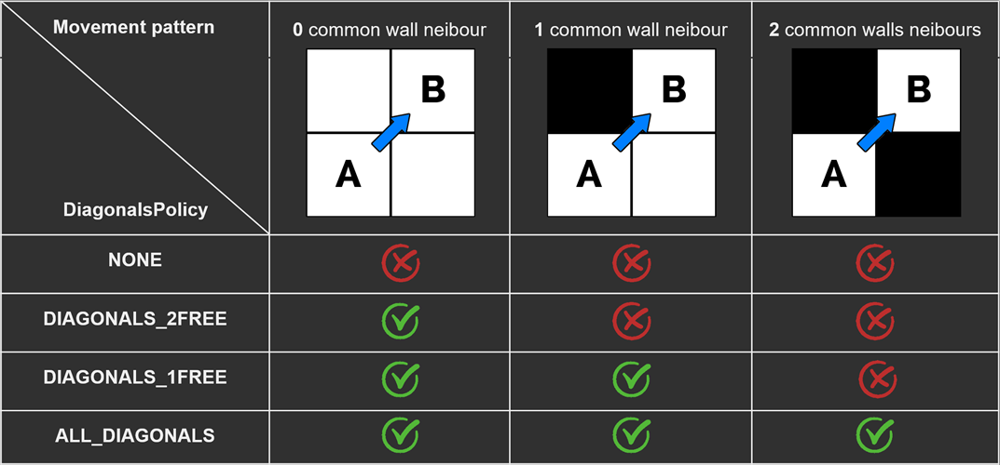

# GridToolkit

[](https://kevincastejon.github.io/com.caskev.unity-grid-toolkit/)

Utilitary API to proceed operations on abstract grids such as tile extraction, raycasting, and pathfinding.

[API References](https://kevincastejon.github.io/com.caskev.unity-grid-toolkit/namespaces.html)

---
## Usage

All you need to use this API is a bi-dimensional array of tiles ordered in row major order (see below).

What is a *tile* ? Any object (custom class, struct, component, ...) that implements the very light **ITile** (**IWeightedTile** for *DijkstraGrid*) interface of this library. This interface requires three properties getters:
- *bool* **IsWalkable** . Must return if the tile can be walk/see throught (for pathfinding/raycasting)
- *int* **X** . Must return the horizontal position of the tile into the grid
- *int* **Y** . Must return the vertical position of the tile into the grid
- *float* **Weight** . Only for *IWeightedTile* Must return the cost movement to enter this tile (minimum 1f).

This API is using a namespace so you have to add a using instruction to the scripts that will need this library:
```cs
using Caskev.GridToolkit;
```

---
#### MajorOrder

When working with two-dimensional arrays there is two ways of storing tiles, first rows then lines or the opposite.  
This is called the **Major Order**. The most common major order used in C languages (and the one used in this library) is the row major order, meaning that the first index of the array represents the row index and the second index represents the column index.

Be aware that the row index actually indicates the vertical position of the tile in the grid, and the column index indicates the horizontal position of the tile in the grid, as it can be counter intuitive.
For more information you can refer to this [Wikipedia article](https://en.wikipedia.org/wiki/Row-_and_column-major_order).

---

## API

---

### Extraction

---
Allows you to extract tiles on a grid.  
Provides shape extraction (rectangles, circles, cones and lines) and neighbors extraction with a lot of parameters.

---
You can extract tiles from shapes.

- **GetTilesInARectangle**
```cs
YourCustomTileType[] tiles = Extraction.GetTilesInARectangle(grid, centerTile, rectangleSize);
```
- **GetTilesInACircle**
```cs
YourCustomTileType[] tiles = Extraction.GetTilesInACircle(grid, centerTile, radius);
```
- **GetTilesInACone**
```cs
YourCustomTileType[] tiles = Extraction.GetTilesInACone(grid, startTile, length, openingAngle, direction);
```
- **GetTilesOnALine**
```cs
YourCustomTileType[] tiles = Extraction.GetTilesOnALine(grid, startTile, length, direction);
```

---
You can extract neighbors of a tile (if existing).

- **GetTileNeighbour**
```cs
YourCustomTileType upperNeighbour = Extraction.GetTileNeighbour(grid, tile, Vector2Int.up);
```
- **GetTileNeighbours**
```cs
YourCustomTileType[] neighbours = Extraction.GetTileNeighbours(grid, tile);
```
- **GetTileOrthogonalsNeighbours**
```cs
YourCustomTileType[] orthogonalNeighbours = Extraction.GetTileOrthogonalsNeighbours(grid, tile);
```
- **GetTileDiagonalsNeighbours**
```cs
YourCustomTileType[] diagonalsNeighbours = Extraction.GetTileDiagonalsNeighbours(grid, tile);
```

---
Each extraction method has a variant to check if a specific tile would be extracted

- **IsTileInARectangle**
```cs
bool isTileInARectangle = Extraction3D.IsTileInARectangle(grid, tile, centerTile, rectangleSize);
```
- **IsTileInACircle**
```cs
bool isTileInACircle = Extraction3D.IsTileInACircle(grid, tile, centerTile, radius);
```
- **IsTileInACone**
```cs
bool isTileInACone = Extraction.IsTileInACone(grid, tile, centerTile, length, openingAngle, direction);
```
- **IsTilesOnALine**
```cs
bool isTilesOnALine = Extraction.IsTilesOnALine(grid, tile, centerTile, length, direction);
```
- **IsTileNeighbor**
```cs
bool isTileRightNeighbor = Extraction.IsTileNeighbor(tile, neighbor, Vector2Int.right);
```
- **IsTileOrthogonalNeighbor**
```cs
bool isTileOrthogonalNeighbor = Extraction.IsTileOrthogonalNeighbor(tile, neighbor);
```
- **IsTileDiagonalNeighbor**
```cs
bool isTileDiagonalNeighbor = Extraction.IsTileDiagonalNeighbor(tile, neighbor);
```
- **IsTileAnyNeighbor**
```cs
bool isTileNeighbor = Extraction.IsTileAnyNeighbor(tile, neighbor);
```

---

### Raycasting

---
Allows you to cast lines of sight and cones of vision on a grid

---
You can get the **line of sight** from a tile (a line that "stops" at the first encountered unwalkable tile).  
Many signatures are available to specify the length and direction of the line.

- **GetLineOfSight**
```cs
YourCustomTileType[] lineOfSight = Raycasting.GetLineOfSight(grid, startTile, destinationTile);
```
---
You can get the **cone of vision** from a tile.  
Many signatures are available to specify the length and direction of the cone.

- **GetConeOfVision**
```cs
YourCustomTileType[] coneOfVision = Raycasting.GetConeOfVision(grid, startTile, openingAngle, destinationTile);
```
---
You can check if a line of sight or a cone of vision is clear (no non-walkable tile encountered)

- **IsLineOfSightClear**
```cs
bool isLineClear = Raycasting.IsLineOfSightClear(grid, startTile, destinationTile);
```
- **IsConeOfVisionClear**
```cs
bool isConeClear = Raycasting.IsConeOfVisionClear(grid, startTile, destinationTile);
```

---

### Pathfinding

---
Allows you to calculate paths between tiles.  
This API offers several ways to do pathfinding, depending on your needs.

You can generate objects that can be seen as layers of data on top of your grid.  
A DirectionGrid will hold all the pre-calculated direction data between a target tile and all the tiles that are accessible to this target.  
A Dijkstra map will hold both direction and distance data.  
Once generated, these objects can contain all the paths you need (ie: a tower defense game with a village core where all enemies have to run to) and then use the paths with almost no performance cost.  
There are also serialization methods to bake or save these objects to files and load them later with the deserialization methods.

These two objects covers the entire grid, but you can also generate a DirectionField or a DijkstraField that will hold the same kind of data but only for tiles that are within a specified distance from the target tile.  
This allows you to run them more often because of the early exit due to the maximum distance parameter (note that more higher is the distance, more costly is the generation).  
Once generated, these objects offers you a way to get the accessible tiles within a range, and paths to them, with almost no performance cost (ie: a strategy game where you want to check the tiles in range of your character)

If you only need a single path between two specific tiles, you can also generate that unique path. But you should keep the other options in mind as it can be way more effective to generate all paths at once rather than generating a unique path again and again.

*Note that, obviously, any path calculation is valid as long as the user grid, walkable states (and weights for dijkstra objects) of the tiles, remains unchanged*

---

#### Diagonals Movements

##### DiagonalPolicy

By default, paths are calculated with orthogonal movements only (up, down, left, right). This is the most efficient way to calculate paths.
You can allow diagonal movements but you have to decide the tolerance regarding the walls common neibours.
You can use the **DiagonalsPolicy** optional parameter, in any pathfinding calculation method, to allow and tune diagonal movements.

Take a look at this schematic to understand how it works:



##### DiagonalsWeight (Only available with *DijkstraGrid*)

When moving diagonally from one tile to another, there is actually more distance covered than when moving with orthogonal movement. 
Mathematically, when the orthogonal distance between two adjacent tiles is 1, then the diagonal distance between two diagonally adjacent tiles is roughly 1.414. The detailed calculation is **Sqrt(x_distance²+y_distance²)**. 
Although it is the most commonly used diagonal movement cost value, you can decide to use any value superior or equal to 1.

---

#### Asynchronous

Every pathfinding calculation method has an asynchronous variant, that returns a **Task**, with additional optional parameters to handle cancellation and be notified of progress.

---

#### DirectionGrid

A DirectionGrid holds direction data between a target tile and all the tiles that are accessible to this target.  
Once generated, this object can contain all the paths you need (ie: a tower defense game with a village core where all enemies run to) and then use the paths with almost no performance cost.  
There are also serialization methods to bake or save these objects to files and load them later with the deserialization methods.

To generate a **DirectionGrid** object, use the **GenerateDirectionGrid** method that needs the *grid* and the *target* tile from which to calculate the paths, as parameters.

```cs
DirectionGrid directionMap = Pathfinding.GenerateDirectionGrid(grid, targetTile);
```

You can retrieve the tile that has been used as the target to generate this **DirectionGrid**.

- **GetTarget**
```cs
YourCustomTileType targetTile = directionMap.GetTarget(grid);
```

You can get all the tiles on the path from a tile to the target.

- **GetPathToTarget**
```cs
YourCustomTileType[] tiles = directionMap.GetPathToTarget(grid, startTile);
```

Or you can get all the tiles on the path from the target to a tile.

- **GetPathFromTarget**
```cs
YourCustomTileType[] tiles = directionMap.GetPathFromTarget(grid, destinationTile);
```

You can know if a tile is accessible from the target tile. This is useful before calling the following **DirectionGrid** methods that only takes an accessible tile as parameter.

- **IsTileAccessible**
```cs
bool isTileAccessible = directionMap.IsTileAccessible(grid, tile);
```

You can get the next tile on the path between the target and a tile.

- **GetNextTileFromTile**
```cs
YourCustomTileType nextTile = directionMap.GetNextTileFromTile(grid, tile);
```

You can get the next tile direction on the path between the target and a tile (in 2D grid coordinates). NextTileDirection is an enum representing the eight possible directions.

- **GetNextTileDirectionFromTile**
```cs
NextTileDirection nextTileDirection = directionMap.GetNextTileDirectionFromTile(grid, tile);
```

You can serialize the generated **DirectionGrid** to a byte array. Usefull for path baking in edit time.

- **ToByteArray**
```cs
byte[] serializedDirectionGrid = directionMap.ToByteArray();
```

You can deserialize a byte array to a **DirectionGrid**. Usefull for loading baked paths at runtime.

- **FromByteArray**
```cs
DirectionGrid directionMap = DirectionGrid.FromByteArray(grid, serializedDirectionGrid);
```

---

#### DijkstraGrid

*Note that a DijkstraGrid object inherits from all the methods and properties of a DirectionGrid object.*

A DijkstraGrid holds both direction and distance data between a target tile and all the tiles that are accessible to this target.  
Once generated, this object can contain all the paths and distance data that you need (ie: a tower defense game with a village core where all enemies run to, or a strategy game in which you would display the distance cost of the movement by hovering tiles with the cursor) and then use the paths with almost no performance cost.  
There are also serialization methods to bake or save these objects to files and load them later with the deserialization methods.

To generate a **DijkstraGrid** object, use the **GenerateDijkstraGrid** method that needs the *grid* and the *target* tile from which to calculate the paths, as parameters.

```cs
DijkstraGrid dijkstraMap = Pathfinding.GenerateDijkstraGrid(grid, targetTile);
```

You can get the distance between the target and a tile.

- **GetDistanceToTarget**
```cs
float distance = dijsktraMap.GetDistanceToTarget(grid, tile);
```

---

#### DirectionField

*Note that a DirectionField object inherits from all the methods and properties of a DirectionGrid object.*

A DirectionField holds the direction data between a target tile and all the tiles that are accessible to this target into the specified maximum distance range.
This allows you to run them more often because of the early exit due to the maximum distance parameter (note that more higher is the distance, more costly is the generation).  
Once generated, this object offers you a way to get the accessible tiles within a range, and paths to them, with almost no performance cost (ie: a strategy game where you want to check the tiles in range of your character)

To generate a **DirectionField** object, use the **GenerateDirectionField** method that needs the *grid* and the *target* tile from which to calculate the paths, as parameters.

```cs
DirectionField directionField = Pathfinding.GenerateDirectionField(grid, targetTile);
```

You can access and iterate over all the accessible tiles.

- **GetAccessibleTile**
```cs
for (int i = 0; i < directionField.AccessibleTilesCount; i++)
{
	YourCustomTileType tile = directionField.GetAccessibleTile(grid, i);
}
```

---

#### DijkstraField

*Note that a DijkstraField object inherits from all the methods and properties of a DijkstraGrid object.*

A DijkstraField holds the direction data between a target tile and all the tiles that are accessible to this target into the specified maximum distance range.
This allows you to run them more often because of the early exit due to the maximum distance parameter (note that more higher is the distance, more costly is the generation).  
Once generated, this object offers you a way to get the accessible tiles within a range, and paths to them, with almost no performance cost (ie: a strategy game where you want to check the tiles in range of your character)

To generate a **DijkstraField** object, use the **GenerateDijkstraField** method that needs the *grid* and the *target* tile from which to calculate the paths, as parameters.

```cs
DijkstraField dijkstraField = Pathfinding.GenerateDijkstraField(grid, targetTile);
```

You can access and iterate over all the accessible tiles and also get their distance to the target.

- **GetAccessibleTile**
```cs
for (int i = 0; i < dijkstraField.AccessibleTilesCount; i++)
{
	YourCustomTileType tile = dijkstraField.GetAccessibleTile(grid, i);
	float distance = dijkstraField.GetDistanceToTarget(grid, tile);
}
```

---

#### Unique path

If you only need a single path between two specific tiles, you can also generate that unique path.  
But you should keep the other options in mind as it can be way more effective to generate all paths at once rather than generating a unique path again and again.

To generate a unique path, use the **GenerateUniquePath** method that needs the *grid*, the *target* tile and the *start** tile from which to calculate the path, as parameters.

```cs
YourCustomTileType[] uniquePath = Pathfinding.GenerateUniquePath(grid, targetTile, startTile);
```
